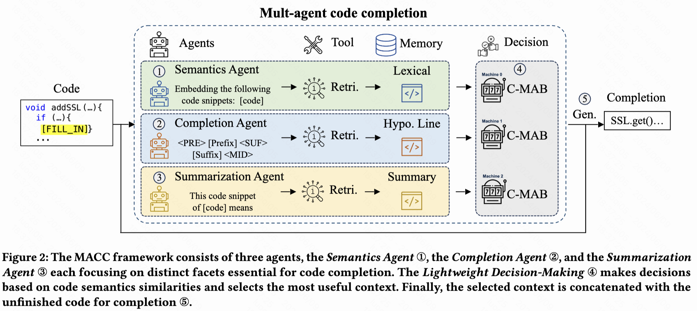

## This is the official repository for ProCC: Prompt-based Code Completion via Multi-Retrieval Augmented Generation

Automated code completion, aiming at generating subsequent tokens from unfinished code, has significantly
benefited from recent progress in pre-trained Large Language Models (LLMs). However, these models often
suffer from coherence issues and hallucinations when dealing with complex code logic or extrapolating beyond
their training data. Existing Retrieval Augmented Generation (RAG) techniques partially address these issues
by retrieving relevant code with a separate encoding model where the retrieved snippet serves as contextual
reference for code completion. However, their retrieval scope is subject to a singular perspective defined by
the encoding model, which largely overlooks the complexity and diversity inherent in code semantics. To
address this limitation, we propose ProCC, a code completion framework leveraging prompt engineering and
the contextual multi-armed bandits algorithm to flexibly incorporate and adapt to multiple perspectives of
code. ProCC first employs a prompt-based multi-retriever system which crafts prompt templates to elicit LLM
knowledge to understand code semantics with multiple retrieval perspectives. Then, it adopts the adaptive
retrieval selection algorithm to incorporate code similarity into the decision-making process to determine the
most suitable retrieval perspective for the LLM to complete the code. Experimental results demonstrate that
ProCC outperforms state-of-the-art code completion technique by 7.92% on public benchmark CCEval, 2.8%
on our collected open-source benchmark suite, and 5.1% on the private-domain benchmark suite collected
from a billion-user e-commerce company in terms of Exact Match. ProCC also allows augmenting fine-tuned
techniques in a plug-and-play manner, yielding an averaged 6.5% improvement over the fine-tuned model.

<p align="center">

</p>


### Evalution
For the open-soure benchmark, use the following script:
```bash
# Download the deepseek-coder-6.7b-instruct model to your local path.
pip install -r requirements.txt
python ./evaluation/run_evaluation_vllm.py \
    --model_path path/deepseek-coder-6.7b-instruct \
    --model_name deepseek \
    --max_new_tokens 128 \
    --testset_path ./benchmark/open-source/test_procc_6.7.json \
    --total_budget 4096 \
    --sample_num -1 \
    --use_vllm True \
    --use_rag True \
    --gpus 8 \
    --gpu_memory_utilization 0.82 \
    --temperature 0 \
    --retrieval completion_agent \
    --group_key type \
    --max_rag_num 1
```

For the cceval benchmark, use the following script to build the environment:
```
git clone https://github.com/amazon-science/cceval.git ./benchmark/cceval
cd ./benchmark/cceval
pip install -r requirements.txt
pip install tree-sitter==0.21.3  # fix tree-sitter version incompatibility issues.
bash scripts/build_treesitter.sh
```
Then use of official inference and evaluation scripts, please refer to [cceval](https://github.com/amazon-science/cceval).
```
cd path_to_procc
# for inference
python benchmark/cceval/scripts/vllm_inference.py \
    --data_root_dir ./benchmark/cceval_data \
    --tp_size 8 \
    --task line_completion_bm25 \
    --language java \
    --model path/deepseek-coder-1.3b-instruct \
    --output_dir ./tmp \
    --model_max_tokens 16384 \
    --use_crossfile_context \
    --crossfile_max_tokens 12800

# for evaluation
python benchmark/cceval/scripts/eval.py \
    --prompt_file ./benchmark/cceval_data/java/line_completion_bm25.jsonl \
    --output_dir ./tmp \
    --ts_lib ./benchmark/cceval/build/java-lang-parser.so \
    --language java \
    --only_compute_metric
```
