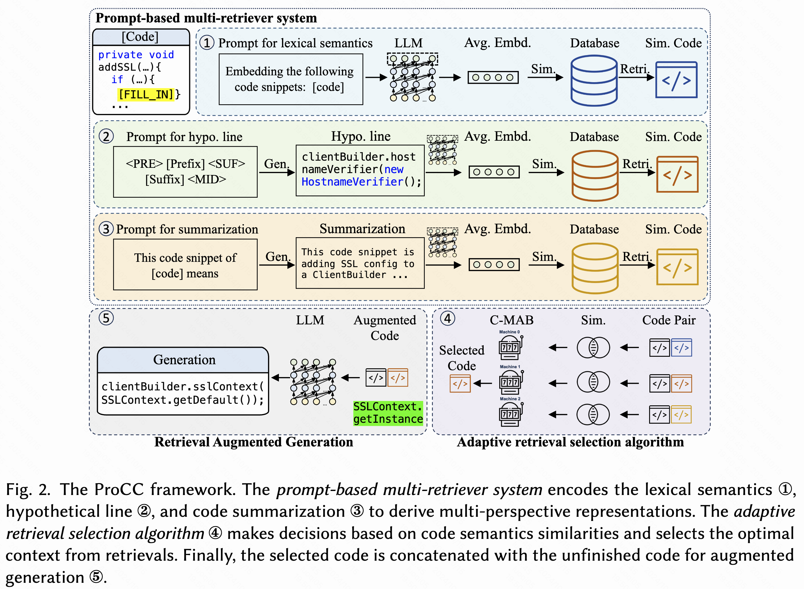

## This is the official repository for MACC: Multi-Agent Code Completion

<p align="center">

</p>


### Evalution
For the open-soure benchmark, use the following script:
```bash
# Download the deepseek-coder-6.7b-instruct model to your local path.
pip install -r requirements.txt
python ./evaluation/run_evaluation_vllm.py \
    --model_path path/deepseek-coder-6.7b-instruct \
    --model_name deepseek \
    --max_new_tokens 128 \
    --testset_path ./benchmark/open-source/test_macc_6.7.json \
    --total_budget 4096 \
    --sample_num -1 \
    --use_vllm True \
    --use_rag True \
    --gpus 8 \
    --gpu_memory_utilization 0.82 \
    --temperature 0 \
    --retrieval completion_agent \
    --group_key type \
    --max_rag_num 1
```

For the cceval benchmark, use the following script to build the environment:
```
git clone https://github.com/amazon-science/cceval.git ./benchmark/cceval
cd ./benchmark/cceval
pip install -r requirements.txt
pip install tree-sitter==0.21.3  # fix tree-sitter version incompatibility issues.
bash scripts/build_treesitter.sh
```
Then use of official inference and evaluation scripts, please refer to (cceval)[https://github.com/amazon-science/cceval].
```
cd path_to_macc
# for inference
python benchmark/cceval/scripts/vllm_inference.py \
	--data_root_dir ./benchmark/cceval_data \
    --tp_size 8 \
    --task line_completion_bm25 \
    --language java \
    --model deepseek-ai/deepseek-coder-1.3b-instruct \
    --output_dir ./tmp \
    --model_max_tokens 16384 \
    --use_crossfile_context \
    --crossfile_max_tokens 12800

# for evaluation
python benchmark/cceval/scripts/eval.py \
    --prompt_file ./benchmark/cceval_data/java/line_completion_bm25.jsonl \
    --output_dir ./tmp \
    --ts_lib ./benchmark/cceval/build/java-lang-parser.so \
    --language java \
    --only_compute_metric
```